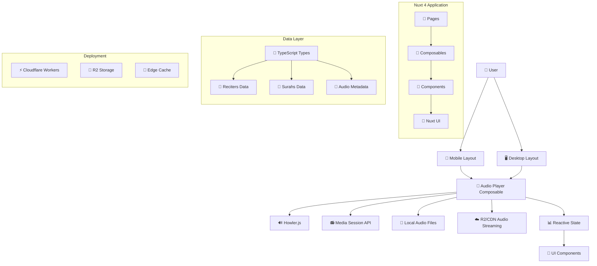

# Project Architecture

## System Overview

Quran-TH follows a modern JAMstack architecture optimized for edge deployment, with a focus on responsive design and audio streaming performance.



## Core Architecture Principles

### 1. **Responsive-First Design**
- **Mobile Priority**: Circular player interface optimized for touch
- **Desktop Enhancement**: Table-based playlist view for larger screens
- **Breakpoint**: 768px (Tailwind `md:` prefix)
- **Layout Strategy**: Component-based responsive switching

### 2. **Composition API Pattern**
- **State Management**: Reactive composables for shared state
- **Logic Separation**: Business logic isolated in composables
- **Type Safety**: Full TypeScript integration
- **Reusability**: Cross-component state and logic sharing

### 3. **Edge-First Deployment**
- **Runtime**: Cloudflare Workers (V8 isolates)
- **Static Assets**: R2 storage with global CDN
- **Performance**: Sub-100ms cold starts
- **Scalability**: Auto-scaling based on demand

## Component Architecture

### Page Components
```
app/pages/
└── index.vue              # Main responsive page
    ├── Mobile Layout       # Circular player UI
    ├── Desktop Layout      # Table-based playlist
    └── Shared Controls     # Common audio controls
```

### Composables Layer
```
app/composables/
├── useAudioPlayer.ts      # Core audio state and controls
├── useAudioConfig.ts      # Audio configuration management
├── useReciters.ts         # Reciter data management
└── useSurahs.ts           # Surah data management
```

### Component Hierarchy
```
index.vue
├── ReciterSelector.vue    # Reciter selection component
├── Mobile Player          # Circular audio interface
│   ├── Play Controls      # Play/pause/skip buttons
│   ├── Progress Ring      # Circular progress indicator
│   └── Track Info         # Current surah/reciter display
└── Desktop Player         # Table-based interface
    ├── Playlist Table     # Surah list with controls
    ├── Audio Bar          # Persistent audio controls
    └── Progress Bar       # Linear progress indicator
```

## Data Flow Architecture

### Audio State Management
```typescript
// Central audio state (useAudioPlayer.ts)
const state = reactive<AudioPlayerState>({
  isPlaying: boolean,
  currentTime: number,
  duration: number,
  currentSurah: number | null,
  currentReciter: number | null,
  // ... additional state
})

// State flows to all components via composable
const { state, play, pause, seek } = useAudioPlayer()
```

### Data Sources

#### Static Data
- **Reciters**: Thai voice actors and translation metadata
- **Surahs**: Chapter information with Thai translations
- **Audio Metadata**: File sizes, durations, formats

#### Dynamic Audio Content
- **Development**: Local audio files (`/public/audio/`)
- **Production**: R2 storage via Cloudflare Workers
- **Streaming**: Progressive audio loading with Howler.js

## Technical Stack

### Frontend Framework
```yaml
Primary: Nuxt 4 (Vue 3 Composition API)
UI Library: Nuxt UI (Tailwind CSS components)
Styling: Tailwind CSS with custom Thai fonts
Type System: TypeScript with strict mode
Audio Engine: Howler.js for advanced audio control
```

### Development Tools
```yaml
Code Quality: ESLint with Nuxt configuration
Type Checking: TypeScript compiler with strict settings
Build Tool: Vite (via Nuxt 4)
Package Manager: npm with lockfile
```

### Deployment Stack
```yaml
Runtime: Cloudflare Workers (V8 isolates)
Storage: Cloudflare R2 for audio files
CDN: Cloudflare global network
Build: Nitro with cloudflare_module preset
```

## Environment Architecture

### Development Environment
```yaml
Audio Source: Local files in /public/audio/
API Mode: Node.js development server
Hot Reload: Vite HMR with Vue DevTools
Network: localhost:3000 with CORS disabled
```

### Production Environment
```yaml
Audio Source: R2 storage via Workers
API Mode: Cloudflare Workers runtime
CDN: Global edge locations
Network: Custom domain with SSL
```

### Configuration Management
```typescript
// nuxt.config.ts - Environment-aware configuration
runtimeConfig: {
  // Server-only (private)
  useLocalAudio: process.env.NODE_ENV === 'development',

  // Client-exposed (public)
  public: {
    useLocalAudio: process.env.NODE_ENV === 'development'
  }
}
```

## Performance Architecture

### Audio Streaming Strategy
1. **Progressive Loading**: Stream audio as needed, not preloaded
2. **Format Optimization**: Multiple formats (MP3/OGG) for compatibility
3. **Caching Strategy**: Browser cache + service worker for offline
4. **Network Awareness**: Adaptive quality based on connection type

### Bundle Optimization
- **Code Splitting**: Nuxt's automatic route-based splitting
- **Tree Shaking**: Remove unused Tailwind classes and JS code
- **Asset Optimization**: WebP images, optimized fonts
- **Critical CSS**: Inline critical styles for faster rendering

### Edge Performance
- **Cold Start**: <100ms Worker initialization
- **Global CDN**: Assets served from nearest edge location
- **Compression**: Gzip/Brotli for all text assets
- **HTTP/3**: Latest protocol support via Cloudflare

## Security Architecture

### Content Security
- **CORS**: Configured for audio CDN access
- **CSP Headers**: Prevent XSS attacks
- **HTTPS Only**: Force secure connections
- **Input Validation**: TypeScript interfaces enforce data safety

### Deployment Security
- **Secrets Management**: Environment variables in Cloudflare
- **Access Control**: R2 bucket permissions
- **API Security**: Rate limiting and origin validation
- **Update Strategy**: Automated security updates

## Scalability Considerations

### Horizontal Scaling
- **Serverless**: Auto-scaling Cloudflare Workers
- **CDN**: Global distribution of static assets
- **Database**: Static data eliminates database scaling concerns
- **State**: Client-side state reduces server load

### Performance Monitoring
- **Core Web Vitals**: LCP, FID, CLS optimization
- **Audio Metrics**: Buffer health, playback errors
- **Edge Analytics**: Cloudflare Workers analytics
- **Error Tracking**: Comprehensive error logging

---

**Next**: [Data Structures →](./data-structures.md)