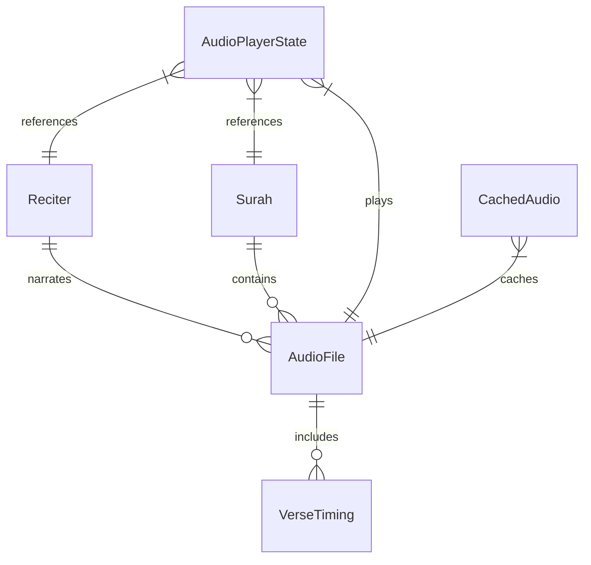

# Data Structures

## TypeScript Interface Definitions

All data structures are defined in `app/types/quran.ts` with comprehensive type safety throughout the application.

## Core Domain Models

### Reciter Interface

Represents voice actors and translators who provide audio narrations.

```typescript
export interface Reciter {
  id: number                    // Unique identifier
  reciter_id: number           // Maps to directory structure (e.g., "001")
  name: string                 // Thai name (e.g., "บรรจง โซะมณี")
  translatedName: string       // Romanized name (e.g., "Bancheong Somanee")
  style: string                // Recording style (e.g., "Thai Translation")
  styleDescription: string     // Thai style description
  qirat: string               // Reading tradition (e.g., "Thai")
}
```

**Current Reciters:**
- **ID 1**: บรรจง โซะมณี (Bancheong Somanee) - Thai Translation
- **ID 2**: อุมัร สุจิตวรรณศรี (Umar Suchitawansri) - Thai Translation

### Surah Interface

Represents Quran chapters with metadata and audio information.

```typescript
export interface Surah {
  id: number                   // Chapter number (1-114)
  name: string                 // Arabic name
  thaiName: string            // Thai translation
  arabicName: string          // Arabic script name
  englishName: string         // English name
  revelationType: 'Meccan' | 'Medinan'  // Revelation location
  versesCount: number         // Number of verses
  order: number              // Revelation order

  // Optional audio metadata
  duration?: number          // Audio length in seconds
  fileSize?: number         // File size in bytes
  bitRate?: number          // Audio bitrate
  format?: string           // File format (mp3, ogg)
  codec?: string            // Audio codec
  originalFilename?: string  // Original file name
  newFilename?: string      // Processed file name
}
```

### Audio System Models

#### AudioFile Interface

Detailed metadata for individual audio files with verse timing information.

```typescript
export interface AudioFile {
  id: number                  // Unique audio file ID
  chapter_id: number         // References Surah.id
  file_size: number          // File size in bytes
  format: string            // Audio format (mp3, ogg, wav)
  audio_url: string         // URL to audio file
  duration: number          // Total duration in milliseconds
  verse_timings: VerseTiming[]  // Verse-by-verse timing data
}
```

#### VerseTiming Interface

Precise timing data for individual verses within audio files.

```typescript
export interface VerseTiming {
  verse_key: string           // Format: "chapter:verse" (e.g., "2:255")
  timestamp_from: number      // Start time in milliseconds
  timestamp_to: number        // End time in milliseconds
  duration: number           // Verse duration in milliseconds
  segments: number[][]       // Word-level timing segments
}
```

#### AudioResponse Interface

API response wrapper for audio file collections.

```typescript
export interface AudioResponse {
  audio_files: AudioFile[]    // Array of audio files for a chapter
}
```

## Application State Models

### AudioPlayerState Interface

Central state management for the audio player functionality.

```typescript
export interface AudioPlayerState {
  // Playback State
  isPlaying: boolean                    // Current playback status
  isLoading: boolean                    // Loading/buffering state
  currentTime: number                   // Current playback position (seconds)
  duration: number                      // Total audio duration (seconds)

  // Audio Settings
  volume: number                        // Volume level (0-100)
  isMuted: boolean                      // Mute state

  // Content Selection
  currentSurah: number | null           // Active chapter ID
  currentReciter: number | null         // Active reciter ID
  currentVerse: number                  // Current verse number

  // Audio Engine References
  audioElement: HTMLAudioElement | null // HTML5 audio element (legacy)
  audioFile: AudioFile | null          // Current audio metadata

  // Error Handling
  error: string | null                  // Error message if playback fails
}
```

### CachedAudio Interface

Client-side audio caching system for offline playback.

```typescript
export interface CachedAudio {
  id: string                  // Cache identifier
  surahId: number            // Chapter ID
  reciterId: number          // Reciter ID
  audioUrl: string           // Original audio URL
  audioData: Blob            // Cached binary audio data
  metadata: AudioFile        // Audio file metadata
  cachedAt: number          // Cache timestamp (Unix time)
  lastAccessedAt: number    // Last access timestamp
  fileSize: number          // Cached file size
}
```

## Data Relationships

### Entity Relationship Diagram



### Data Flow Relationships

1. **Reciter Selection** → Updates `AudioPlayerState.currentReciter`
2. **Surah Selection** → Updates `AudioPlayerState.currentSurah`
3. **Audio Loading** → Fetches matching `AudioFile` based on reciter + surah
4. **Playback** → Uses `VerseTiming` data for verse highlighting
5. **Caching** → Stores `AudioFile` data as `CachedAudio` for offline use

## Data Storage Strategy

### Static Data Files

#### Reciters Data
```typescript
// app/data/reciters.ts
export const reciters: Reciter[] = [
  {
    id: 1,
    reciter_id: 1,
    name: 'บรรจง โซะมณี',
    translatedName: 'Bancheong Somanee',
    style: 'Thai Translation',
    styleDescription: 'แปลภาษาไทย',
    qirat: 'Thai'
  }
  // ... additional reciters
]
```

#### Reciter-Specific Surah Metadata
```json
// app/data/surah/001.json (Reciter 1 data)
[
  {
    "id": 1,
    "name": "อัล-ฟาติฮะฮ์",
    "verseCount": 7,
    "revelationPlace": "makkah",
    "slug": "al-fatihah",
    "filename": "001.ogg",
    "duration": 87.010833,
    "fileSize": 689921,
    "bitrate": 63433,
    "format": "ogg",
    "codec": "opus"
  }
  // ... more surahs
]
```

### Runtime Data Management

#### Composable State
```typescript
// State managed by composables
const { reciters } = useReciters()           // Reciter[]
const { surahs } = useSurahs()              // Surah[]
const { state } = useAudioPlayer()          // AudioPlayerState
const { config } = useAudioConfig()         // Configuration
```

## Type Safety Features

### Strict TypeScript Configuration

```json
// tsconfig.json
{
  "compilerOptions": {
    "strict": true,
    "noImplicitReturns": true,
    "noUnusedLocals": true,
    "noUnusedParameters": true
  }
}
```

### Runtime Type Validation

```typescript
// Example: Type guards for runtime safety
function isValidSurah(value: any): value is Surah {
  return typeof value === 'object' &&
         typeof value.id === 'number' &&
         typeof value.name === 'string' &&
         ['Meccan', 'Medinan'].includes(value.revelationType)
}

// Usage in composables
if (!isValidSurah(selectedSurah)) {
  throw new Error('Invalid surah data')
}
```

### Interface Extensions

```typescript
// Example: Extending base interfaces for specific use cases
interface SurahWithProgress extends Surah {
  progress: number        // Playback progress (0-100)
  isPlaying: boolean     // Current playback state
  isCached: boolean      // Available offline
}

interface ReciterWithStats extends Reciter {
  totalChapters: number  // Available chapters
  totalDuration: number  // Total content duration
  downloadSize: number   // Total download size
}
```

## Data Validation Patterns

### Input Validation
```typescript
// Validate user input for surah selection
function validateSurahSelection(surahId: number): boolean {
  return surahId >= 1 && surahId <= 114 && Number.isInteger(surahId)
}

// Validate reciter selection
function validateReciterSelection(reciterId: number, availableReciters: Reciter[]): boolean {
  return availableReciters.some(reciter => reciter.id === reciterId)
}
```

### Error Handling Types
```typescript
type AudioError =
  | 'NETWORK_ERROR'
  | 'FILE_NOT_FOUND'
  | 'DECODE_ERROR'
  | 'PERMISSION_DENIED'
  | 'UNKNOWN_ERROR'

interface AudioPlayerError {
  type: AudioError
  message: string
  timestamp: number
  context: {
    surahId?: number
    reciterId?: number
    audioUrl?: string
  }
}
```

---

**Next**: [Audio System →](./audio-system.md)